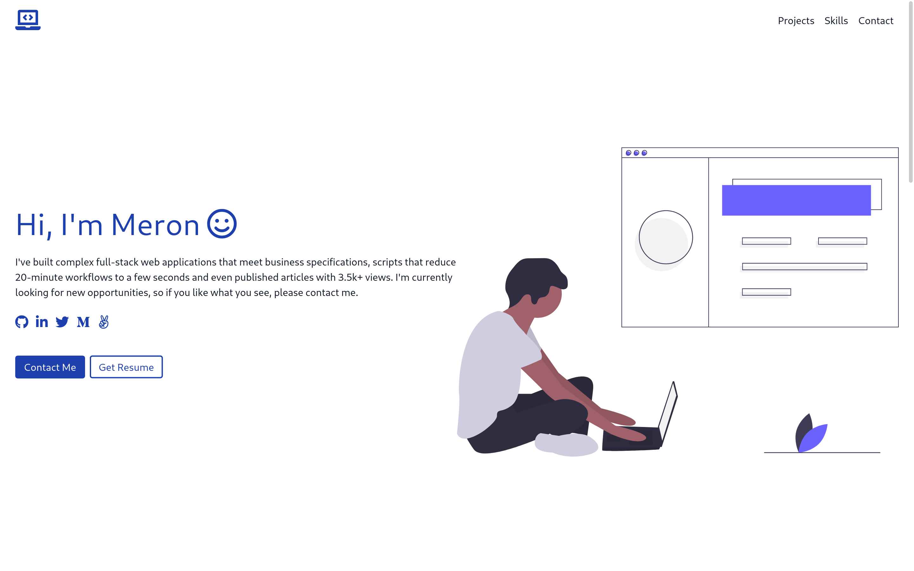

# Portfolio

> A beautiful and performant web portfolio for developers.

## Features

- Responsive and accessible to all devices.
- Fetch pinned Github repositories via the Graphql Github API and display them.
- Utilize Serverless to run server-side code.

## Built With

- Javascript
- TailwindCSS
- GraphQL
- Font Awesome
- Webpack

## Live Demo

[Live Demo](https://meronogbai.me)

## Prerequisites

- npm
- Netlify CLI

## Install

1. Fork the repo and clone it.
1. `cd` into the project directory.
1. Run `npm install` to install the necessary dependencies.

## Usage

1. Spin up a local server that auto reloads when you edit and save your code by executing `netlify dev`.
1. Execute `npm run build` when you're ready to deploy.

## Deploy

1. Execute `netlify init` to setup CI/CD with netlify, or run `netlify link` to link a deployed netlify site.
1. Set  the values of `API_URL`, `API_TOKEN` and `USER_LOGIN` to [Github GraphQL API URL](https://docs.github.com/en/graphql/guides/forming-calls-with-graphql#the-graphql-endpoint), your [Github Personal Access Token](https://github.com/settings/tokens) and Github userame, respectively, in Netlify [environemt variables](https://docs.netlify.com/configure-builds/environment-variables/).
1. Commit and push your code to Github and enjoy your awesome portfolio website.

## Author

👤 **Meron Ogbai**

- Github: [@meronokbay](https://github.com/meronokbay)
- Twitter: [@MeronDev](https://twitter.com/MeronDev)
- Linkedin: [Meron Ogbai](https://linkedin.com/in/meron-ogbai/)

## 🤝 Contributing

Contributions, issues, and feature requests are welcome!

## Show your support

Give a ⭐️ if you like this project!

## Acknowledgments

- [undraw](https://undraw.co/)

## 📝 License

This project is [MIT](./LICENSE) licensed.
