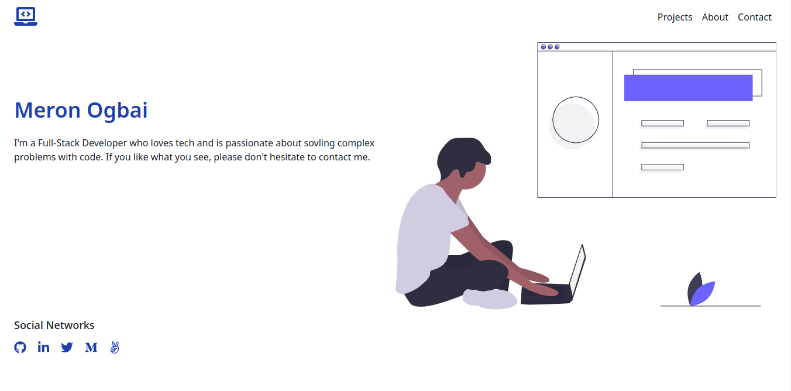

# Portfolio

> This repo hosts the code for my personal portfolio.

## Built With

- Javascript
- TailwindCSS
- Webpack

## Live Demo

[Live Demo Link](https://meronogbai.me)

## Prerequisites

- npm
- node

## Install

1. Clone the repo.
1. `cd` into the project directory.
1. Run `npm install` to install the necessary dependencies.

## Usage

1. Run `npm start` to open the project in your default browser.
1. Edit the code and run `npm run build` to compile it before deployment.

## Author

👤 **Meron Ogbai**

- Github: [@meronokbay](https://github.com/meronokbay)
- Twitter: [@MeronDev](https://twitter.com/MeronDev)
- Linkedin: [Meron Ogbai](https://linkedin.com/in/meron-ogbai/)

## 🤝 Contributing

Contributions, issues, and feature requests are welcome!

## Show your support

Give a ⭐️ if you like this project!

## Acknowledgments

- [undraw](https://undraw.co/)

## 📝 License

This project is [MIT](./LICENSE) licensed.
